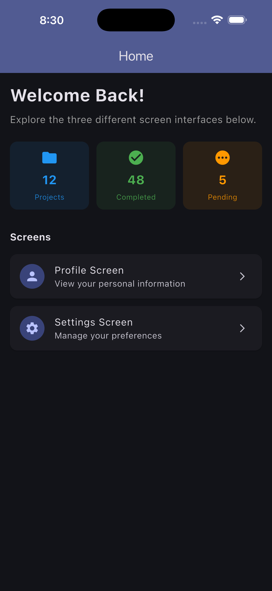
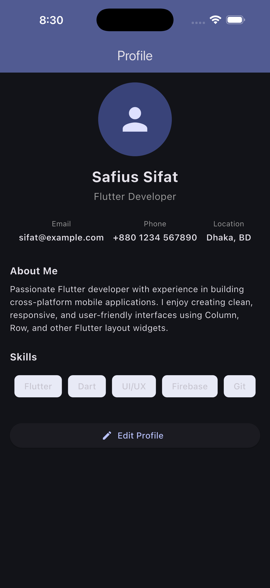
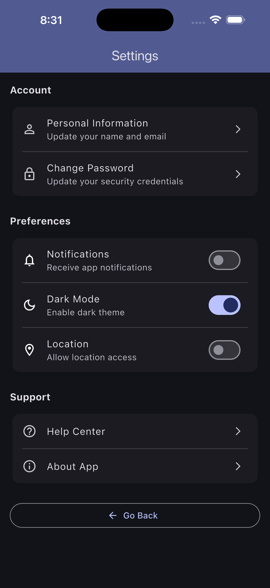

# Module 4 Assignment 1 — Three Screen Interfaces

A Flutter application demonstrating three different screen interfaces built with `Column`, `Row`, and other core layout widgets. The app uses **Provider** for state management, **SharedPreferences** for persistence, and **go_router** for navigation.

## Screens

| Home | Profile | Settings |
|------|---------|----------|
|  |  |  |

### Home Screen
- Dashboard with welcome message and quick stat cards.
- Navigation cards to open the Profile and Settings screens.

### Profile Screen
- Displays avatar, name, role, contact details, bio, and skills.
- Built using `Column`, `Row`, and `Wrap` layouts.

### Settings Screen
- Account and preference options.
- Toggle switches for notifications, dark mode, and location.
- All changes are persisted through `SharedPreferencesService`.

## Architecture

```
lib/
├── main.dart                       # App bootstrap
├── app.dart                        # MultiProvider + MaterialApp.router
├── models/
│   ├── app_settings.dart           # Immutable settings model
│   └── user_profile.dart           # Immutable profile model
├── providers/
│   ├── settings_provider.dart      # Settings state + persistence
│   ├── theme_provider.dart         # Theme mode derived from settings
│   └── profile_provider.dart       # Profile state
├── routes/
│   ├── app_router.dart             # go_router configuration
│   └── route_names.dart            # Route constants
├── screens/
│   ├── home_screen.dart            # Dashboard screen
│   ├── profile_screen.dart         # Profile screen
│   └── settings_screen.dart        # Settings screen
├── services/
│   └── shared_preferences_service.dart # Local storage abstraction
└── widgets/
    ├── section_header.dart
    ├── skill_chip.dart
    └── stat_card.dart
```

## Concepts learned

- Practical use of `Column`, `Row`, and `Wrap`.
- State management with **Provider**.
- Declarative navigation with **go_router**.
- Local persistence with **SharedPreferences**.
- Separation of concerns across models, providers, services, routes, and screens.

## Getting started

1. Make sure you have [Flutter](https://docs.flutter.dev/get-started/install) installed.
2. Navigate into the project folder:

   ```bash
   cd mod_4_assignment_1
   ```

3. Install dependencies:

   ```bash
   flutter pub get
   ```

4. Run the app:

   ```bash
   flutter run
   ```

## Running tests

```bash
flutter test
```
