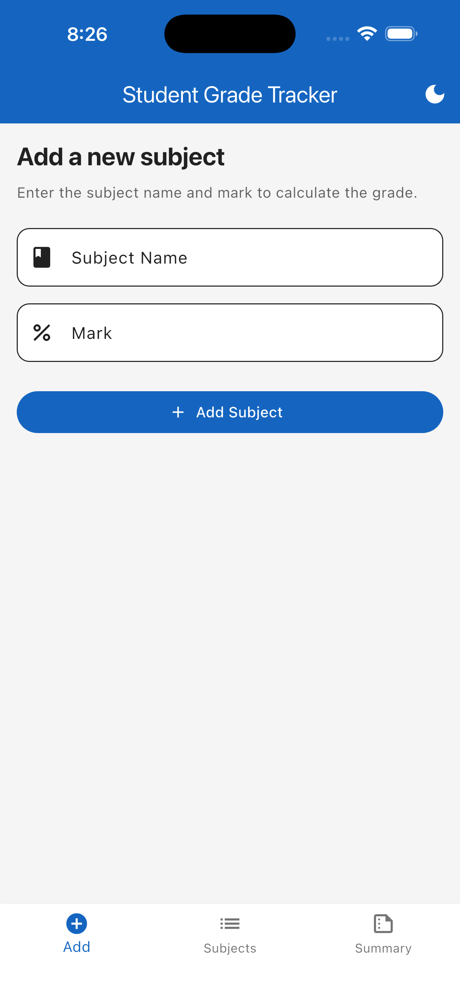
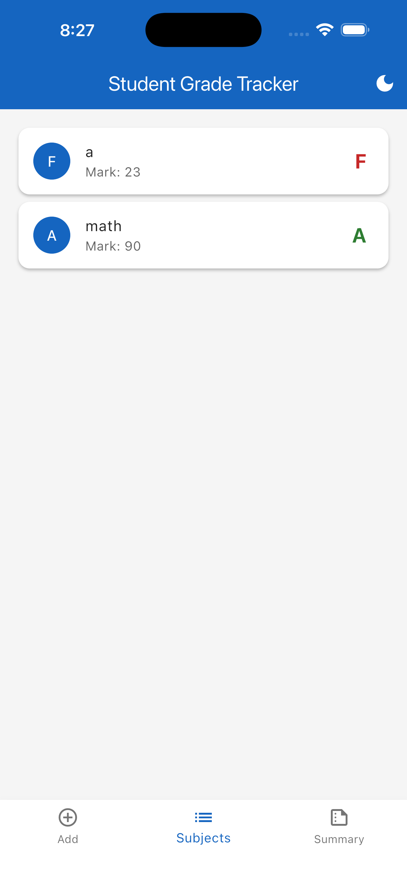
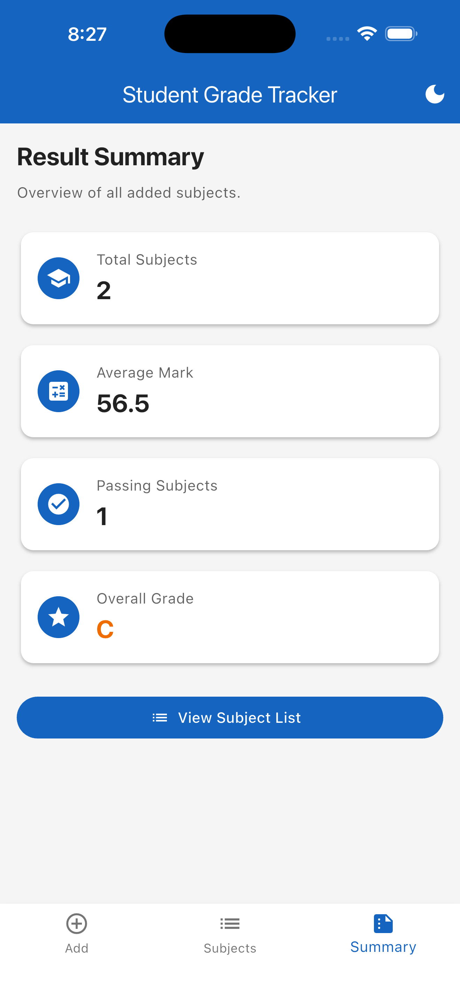

# Student Grade Tracker

A simple Flutter application for students to add subjects with marks, view individual grades, and see a live result summary.

## Screenshots

| Add Subject | Subject List | Summary |
|-------------|--------------|---------|
|  |  |  |

## Features

- **Add Subject** – Enter a subject name and mark (0–100) with form validation.
- **Subject List** – View all subjects with their marks and letter grades; swipe to delete.
- **Summary** – See total subjects, average mark, passing count, and overall grade that updates live.
- **Theme Toggle** – Switch between custom light and dark themes from the AppBar.

## Architecture

- **State Management:** [Provider](https://pub.dev/packages/provider) – no `setState` is used anywhere in the app.
- **Models:** `Subject` class with a private `_mark` field and a public `grade` getter.
- **Providers:**
  - `SubjectProvider` manages the list of subjects and summary calculations.
  - `ThemeProvider` manages light/dark mode.
  - `NavigationProvider` manages the bottom navigation index.
- **Theming:** Fully custom `ThemeData` for both light and dark modes; all UI colors are sourced from `Theme.of(context)`.

## Requirements checked

- [x] `Subject` class with private `_mark` field and `grade` getter.
- [x] `List<Subject>` with `.where()` used to filter passing subjects.
- [x] Form validation for empty name and marks outside 0–100.
- [x] `ListView.builder` with `Dismissible` items.
- [x] Live summary updates when subjects are added or removed.
- [x] Custom light/dark themes with no hardcoded colors in widgets.
- [x] All state managed with Provider; zero `setState` calls.

## Getting started

1. Make sure you have [Flutter](https://docs.flutter.dev/get-started/install) installed.
2. Clone or navigate into the project folder:

   ```bash
   cd mod_5_assignment_1
   ```

3. Install dependencies:

   ```bash
   flutter pub get
   ```

4. Run the app:

   ```bash
   flutter run
   ```

## Running tests

```bash
flutter test
```

## Project structure

```
lib/
├── main.dart                          # App entry point and providers
├── models/
│   └── subject.dart                   # Subject model with grade getter
├── providers/
│   ├── navigation_provider.dart       # Bottom nav index
│   ├── subject_provider.dart          # Subject list and summary logic
│   └── theme_provider.dart            # Light/dark mode
├── screens/
│   ├── add_subject_screen.dart        # Screen 1: form to add subjects
│   ├── main_screen.dart               # Scaffold with bottom navigation
│   ├── subject_list_screen.dart       # Screen 2: list with dismissible items
│   └── summary_screen.dart            # Screen 3: live summary
└── themes/
    └── app_themes.dart                # Custom light and dark themes
```
